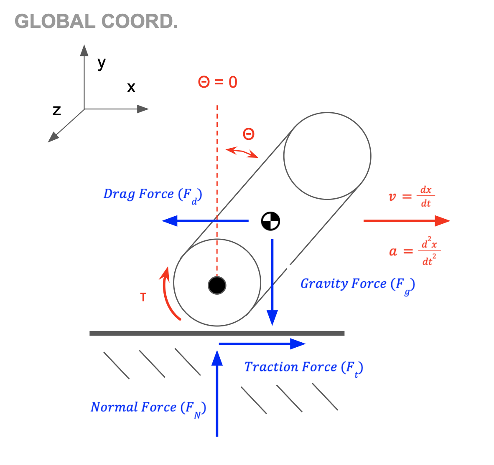
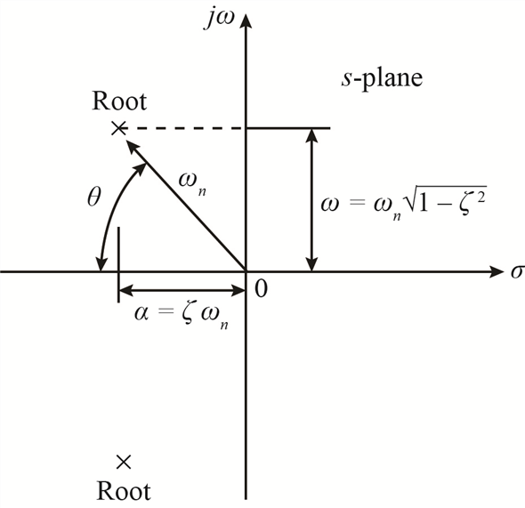

# Stunt Car Inverted Pendulum Explicit ODE Formulation
 
*Produced by Andrew J. D'Onofrio (B.S. MechE '26)*
 
The following is a control system representation of a stunt car operating as an inverted pendulum. This is inspired by Cornell University's ECE 4160 / MAE 4190 Fast Robots final project, which requires operating a custom stunt car as a PID-controlled inverted pendulum using ToF and 9DOF IMU sensors. This is a modular program for designs of various geometries and masses, which all operate under the same underlying dynamics.
 
The following is a basic step-by-step rationalization for the dynamics of the unstable system, including the implicit and explicit ordinary differential equations (ODEs).
 
---
 
# Background for `Pendulum_Model.py`
 
## 1. General Background
 
### Example Stunt Car Parameters (from Fast Robots 2026)
 
| Parameter | Symbol | Value |
|---|---|---|
| Mass | m<sub>car</sub> | 389.55 g |
| Length | l<sub>car</sub> | 175 mm |
| Width | w<sub>car</sub> | 140 mm |
| Height | h<sub>car</sub> | 75 mm |
| Wheel radius | r<sub>wheel</sub> | 75 mm |
 
### Global Definitions
 
**Coordinates** <br>
- *Global Coordinate System*: **X**<sub>global</sub> = [X, Y, Z] with θ about Z<br>

**General Definitions** <br>
- *x (Displacement)* — the linear translation of the car at the pivot
- *ẋ (Velocity)* — the linear velocity of the car at the pivot
- *θ (Angular Displacement)* — the rotation of the car relative to the neutral axis (θ = 0)
- *θ̇ (Angular Velocity)* — the angular velocity of the car relative to the neutral axis (θ = 0)<br>

**Initial Conditions (ICs)** <br>
- *Horizontal Alignment*: x(0) = 0 mm
- *No Horizontal Velocity*: ẋ(0) = 0 mm/s
- *Pre-Set Angular Displacement*: θ(0) = 0.5°
- *No Angular Velocity*: θ̇(0) = 0°/s<br>

**Relevant Forces** <br>
- *Drag Force*: F<sub>Drag</sub> = (1/2)·ρ·C<sub>D</sub>·A·ẋ
- *Gravitational Force*: F<sub>Gravity</sub> = m·g
- *Traction Force*: F<sub>Traction</sub> = τ/R
- *Normal Force*: F<sub>Normal</sub> = -m·g<br>

**Visual Diagram** <br>
 

 
### 2nd Order ODE Dynamic Representation of Center of Mass
 
*Set-up the force balance based on the FBD:* F<sub>External</sub> = m<sub>car</sub>·a
 
- **F<sub>x</sub>**: F<sub>Traction</sub> − F<sub>Drag</sub> = m<sub>car</sub>·a<sub>x</sub>
- **F<sub>y</sub>**: F<sub>Gravity</sub> = m<sub>car</sub>·a<sub>y</sub><br>

*Solve for acceleration terms (a<sub>x</sub> and a<sub>y</sub>) in terms of displacement and rotation about the center of mass:* <br>
 
- x<sub>COM</sub> = x<sub>Pivot</sub> + l/2·sin(θ)
- y<sub>COM</sub> = l/2·cos(θ)
- ẋ<sub>COM</sub> = ẋ<sub>Pivot</sub> + l/2·cos(θ)·θ̇
- ẏ<sub>COM</sub> = -l/2·sin(θ)·θ̇
- ẍ<sub>COM</sub> = ẍ<sub>Pivot</sub> + l/2·(cos(θ)·θ̈ − sin(θ)·θ̇<sup>2</sup>)
- ÿ<sub>COM</sub> = -l/2·(sin(θ)·θ̈ + cos(θ)·θ̇<sup>2</sup>)

*Substituting back into the force balances:* <br>
 
- **F<sub>x</sub>**: F<sub>Traction</sub> − F<sub>Drag</sub> = m<sub>car</sub>·(ẍ<sub>Pivot</sub> + l/2·(cos(θ)·θ̈ − sin(θ)·θ̇<sup>2</sup>))
- **F<sub>y</sub>**: F<sub>Gravity</sub> = -m<sub>car</sub>·l/2·(sin(θ)·θ̈ + cos(θ)·θ̇<sup>2</sup>)
- **F<sub>x</sub>**: τ/R − (1/2)·ρ·C<sub>D</sub>·(l·w)·ẋ = m<sub>car</sub>·(ẍ<sub>Pivot</sub> + l/2·(cos(θ)·θ̈ − sin(θ)·θ̇<sup>2</sup>))
- **F<sub>y</sub>**: m·g = -m<sub>car</sub>·l/2·(sin(θ)·θ̈ + cos(θ)·θ̇<sup>2</sup>)

## 2. Nonlinear Form of the ODE System
 
*State Vector*: **z** = [z<sub>1</sub>, z<sub>2</sub>, z<sub>3</sub>, z<sub>4</sub>]<sup>T</sup> = [x, ẋ, θ, θ̇] <br>
*Input Parameter*: u = τ
 
### Standard Nonlinear ODE (**z** = [z<sub>1</sub>, z<sub>2</sub>, z<sub>3</sub>, z<sub>4</sub>]<sup>T</sup>)
 
- *Linear Displacement*: z<sub>1</sub> = x
- *Linear Velocity*: z<sub>2</sub> = ẋ
- *Angular Displacement*: z<sub>3</sub> = θ
- *Angular Velocity*: z<sub>4</sub> = θ̇
### Derivative Nonlinear ODE (**ż** = [ż<sub>1</sub>, ż<sub>2</sub>, ż<sub>3</sub>, ż<sub>4</sub>]<sup>T</sup>)
 
- *Linear Velocity*: ż<sub>1</sub> = z<sub>2</sub> = ẋ
- *Linear Acceleration*: ż<sub>2</sub> = [ ((1/3)l² + (1/12)w²)·u + C<sub>d</sub>·z<sub>2</sub>·|z<sub>2</sub>|·((l²/4)cos²z<sub>3</sub> − ((1/3)l² + (1/12)w²)) + ((1/3)l² + (1/12)w²)·m<sub>car</sub>·(l/2)·sin(z<sub>3</sub>)·z<sub>4</sub>² − (l²/4)·m<sub>car</sub>·g·sin(z<sub>3</sub>)·cos(z<sub>3</sub>) ] / (m<sub>car</sub>·((1/12)(l² + w²) + (l²/4)sin²z<sub>3</sub>))
- *Angular Velocity*: ż<sub>3</sub> = z<sub>4</sub> = θ̇
- *Angular Acceleration*: ż<sub>4</sub> = (l/2) / ((1/12)(l² + w²) + (l²/4)sin²z<sub>3</sub>) · [ g·sin(z<sub>3</sub>) − u·cos(z<sub>3</sub>)/m<sub>car</sub> − (l/2)·z<sub>4</sub>²·sin(z<sub>3</sub>)·cos(z<sub>3</sub>) ]
## 3. Linearized State-Space Model
 
*Equilibrium Point*: z<sub>eq</sub> = [0, 0, 0, 0]<sup>T</sup>, u<sub>eq</sub> = 0 (upright, at rest, no input)
 
**Linear State-Space Form**: **ż** = A**z** + B**u**
 
```
z =
[ x ]
[ ẋ ]
[ θ ]
[ θ̇ ]
 
u = [ τ ]
 
A =
[ 0     1               0              0 ]
[ 0     0          -3gl²/(l²+w²)       0 ]
[ 0     0               0              1 ]
[ 0     0          6gl/(l²+w²)         0 ]
 
B =
[            0               ]
[ (4l² + w²)/(m_car(l² + w²)) ]
[            0               ]
[  -6l/(m_car(l² + w²))       ]
```
 
---
 
# Background for `Pendulum_Tuner.py`
 
## 1. Laplace Transform for Poles (from Linearized Model)
 
*With small angle approximation:* θ̈ = A0 − Bu
 
1. θ̈ − Aθ = −Bu
2. L{θ̈} − L{Aθ} = −{Bu}
3. s²{θ̈(s)} − A{θ(s)} = −B{U(s)}
4. θ(s) = −B{U(s)} / s²{θ̈(s)} − A{θ(s)} *(assume zero initial conditions)*
5. G(s) = θ(s) / U(s) = −B / (s² − A)
6. *Poles:* s² − A = 0, s<sub>Poles</sub> = p<sub>1,2</sub> = ±√A
## 2. Poles of Response Dynamics
 
**Closed-Loop Characteristic Equation:** K<sub>p</sub> + K<sub>i</sub> / s + K<sub>d</sub> / s
 
U(s) = C(s)·θ(s) = s³ + B·K<sub>d</sub>·s² + (B·K<sub>p</sub> − A)·s + B·K<sub>i</sub> = 0
 
## 3. S-Plane Plotting for Optimizing Dynamic Response
 
*Input selected K<sub>p</sub>, K<sub>i</sub>, K<sub>d</sub> into closed-loop characteristic equation, and solve for the s-poles and express in the standard form:*
 
1. Plug PID values into s³ + B·K<sub>d</sub>·s² + (B·K<sub>p</sub> − A)·s + B·K<sub>i</sub> = 0 (Closed-Loop Characteristic Equation)
2. Turn Cubic Equation (s³) to Quadratic Equation (s²)
3. Determine ωₙ and ζ with the standard form s² + 2ζωₙ·s + ωₙ² = 0
4. Solve for σ (Decay Rate, −ζωₙ) and ω (Oscillation Frequency, ωₙ√(1−ζ²))
5. Plot on s-plane with s = σ ± jω
**Visual Diagram 1**
 

 
**Visual Diagram 2**
 


# Background for "Pendulum_GUI.py"

**1. Clone the repository to Laptop IDE**
&nbsp; The script is not accessible through the GitHub Codespace. Recommend to use Visual Studio Code to manage virtual environment and files.
